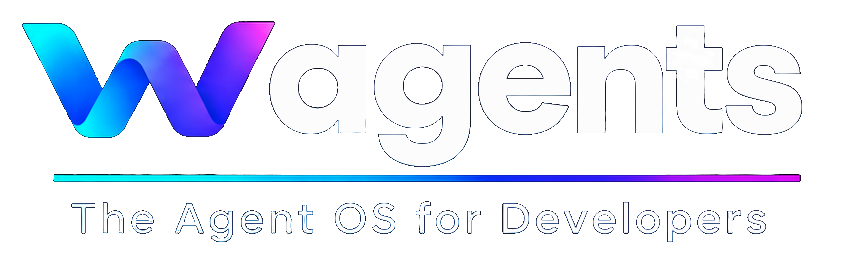
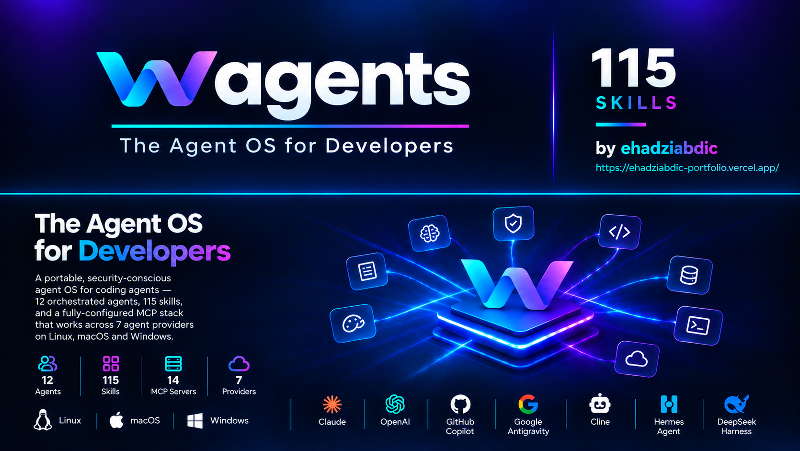

<div align="center">



# WAgents

**A portable, security-conscious Agent OS for coding agents, 12 orchestrated agents, 115 skills, and a fully-configured MCP stack that works across 7 agent providers on Linux, macOS, and Windows.**

[](LICENSE)
[](https://nodejs.org)

[](#installation)
[](#using-the-agentic-setup)
[](https://github.com/ehadziabdic/WAgents/actions/workflows/ci.yml)
[](https://github.com/ehadziabdic/WAgents/actions/workflows/dependabot/dependabot-updates)

*Claude Code · OpenAI Codex · GitHub Copilot CLI · Google Antigravity · Cline · Hermes Agent · DeepSeek Harness*

</div>

---

## Table of contents

- [Why WAgents](#why-WAgents)
- [Architecture at a glance](#architecture-at-a-glance)
- [Quick start](#quick-start)
- [Installation](#installation)
  - [Prerequisites](#prerequisites)
  - [Route A: one-command install](#route-a-one-command-install)
  - [Route B: plugin marketplace](#route-b-plugin-marketplace-claude-code-copilot-codex)
  - [Route C: npm](#route-c-npm)
  - [Route D: provider-native (DeepSeek Harness, Cline)](#route-d-provider-native-deepseek-harness-cline)
- [Post-install configuration](#post-install-configuration)
  - [Environment variables](#environment-variables)
  - [The memory server (agentmemory)](#the-memory-server-agentmemory)
  - [Verify your install](#verify-your-install)
- [MCP catalog: install & configure every server](#mcp-catalog-install--configure-every-server)
  - [Wiring MCP into your client](#wiring-mcp-into-your-client)
  - [Server-by-server reference](#server-by-server-reference)
- [Using the agentic setup](#using-the-agentic-setup)
  - [Slash commands](#slash-commands)
  - [How delegation works](#how-delegation-works)
  - [Skills](#skills)
  - [Cross-agent memory](#cross-agent-memory)
  - [Hooks](#hooks)
  - [Hacker mode (offensive security)](#hacker-mode-offensive-security)
  - [Per-project overrides](#per-project-overrides)
- [Updating](#updating)
- [Extending WAgents](#extending-WAgents)
- [Security model](#security-model)
- [Repository structure](#repository-structure)
- [License & acknowledgements](#license-acknowledgements)

---

## Why WAgents

Most agent setups are a pile of copy-pasted prompts. WAgents is a **single repository that is itself the plugin**: one source of truth for agents, skills, instructions, permissions, hooks, and MCP configuration: validated on every commit: installable into any of seven agent providers without forking the content per tool.

| | What you get |
|---|---|
| **12 orchestrated agents** | A main orchestrator (`WAgents`), a gated offensive-security mode (`WAgents-hacker`), and 10 specialists: with enforced delegation rules, not vibes |
| **115 skills, 11 groups** | Engineering workflow (superpowers), MLOps/LLMOps, DevOps advisors, security review, UI/design taste, Obsidian vault authoring, Anthropic office formats, and more: every one frontmatter-validated |
| **14 MCP servers, catalogued** | Pinned npm installs, remote OAuth servers, and on-demand launchers: with per-agent scoping and an auditable `mcp/servers.json` |
| **Persistent cross-agent memory** | [agentmemory](https://github.com/rohitg00/agentmemory) vendored end-to-end: 17 memory skills registered for every agent + 12 auto-capture lifecycle hooks. What one agent learns, all agents recall |
| **Security by construction** | No secrets in git, least-privilege permissions per agent, read-only reviewer/researcher lanes, explicit authorization gate for anything offensive |
| **Self-verifying** | 17-test suite + structural verifier + skill smoke tests + agent-guide validator, all green in CI and locally |

---

## Architecture at a glance

Two **main agents** route work; ten **specialists** execute. Mains may delegate; specialists never do.

| Agent | Role | Notes |
|---|---|---|
| `WAgents` | **Main**: intent, architecture decisions, routing, parallel delegation, integration, validation | Default agent; merged orchestrator + architect |
| `WAgents-hacker` | **Main**: authorized offensive security, full engagement driver | Explicit target authorization required; exclusive `base-hacker-claude-red` skill set |
| `frontend-designer` | UI/UX, visual hierarchy, accessibility, frontend implementation, browser QA | |
| `backend-engineer` | APIs, auth, database, business logic, performance | |
| `security-engineer` | Defensive security, threat modeling, scanning, remediation verification | |
| `code-reviewer` | Independent correctness, maintainability, security, tests | Read-only lane |
| `debugger` | Root-cause analysis, minimal fix, regression test | |
| `qa-engineer` | Unit / integration / API / E2E / browser / regression testing | |
| `research-specialist` | Web research, docs verification, evidence-backed recommendations | Read/search only |
| `documentation-specialist` | Diátaxis docs, diagrams, slides, Obsidian vaults, Word/PDF/PPTX/XLSX deliverables | |
| `ml-engineer` | Python/data, ML experiments, evaluation, RAG/LLM, pipelines | |
| `devops-engineer` | Docker, k8s, CI/CD, cloud, deployment, observability, release/rollback | |

Delegation rules (enforced, see `config/agents.json`): only mains delegate. `WAgents` may call every specialist except `WAgents-hacker`; `WAgents-hacker` may call every specialist except `WAgents`; mains never call each other; specialists never delegate.

## Quick start

```bash
git clone https://github.com/ehadziabdic/WAgents.git
cd WAgents
./install.sh --provider claude-code   # Linux/macOS: Windows: .\install.ps1 -Provider claude-code
npm run memory                        # start the shared memory server
```

That's it: the provider CLI installs the plugin from the local checkout, the pinned npm
MCPs are installed, and the memory layer is live at `http://localhost:3111`.

---

## Installation

### Prerequisites

| Requirement | Why | Notes |
|---|---|---|
| `git` | clone + marketplace installs | all platforms |
| `node` ≥ 20 | WAgents CLI, MCP auto-installer, most MCP servers | Sentry's MCP runtime wants ≥ 22.13; DeepSeek Harness wants ^22.19 ‖ ≥ 24 |
| `python` 3 | `validate-agent-guide.py` (verification only) | not needed at runtime |
| `bash` | `.sh` helper scripts on Windows | Git Bash or WSL; PowerShell entry points provided |
| A provider CLI | the agent host you're installing into | see [Route B](#route-b-plugin-marketplace-claude-code-copilot-codex) |

### Route A: one-command install

```bash
# Linux / macOS
git clone https://github.com/ehadziabdic/WAgents.git && cd WAgents
./install.sh --provider <name>        # --dry-run to preview, --skip-mcps to defer MCP installs
```

```powershell
# Windows (PowerShell)
git clone https://github.com/ehadziabdic/WAgents.git; cd WAgents
.\install.ps1 -Provider <name>        # -DryRun / -SkipMcps switches available
```

`install.sh` / `install.ps1` are thin wrappers over the cross-platform CLI
(`bin/WAgents.mjs`), which: syncs the root manifests, auto-installs the pinned npm MCPs,
builds the plugin, and runs the provider's native install steps.

### Route B: plugin marketplace (Claude Code, Copilot, Codex)

The repository root **is** the plugin and ships its own marketplace manifests, all pointing
at `./` (superpowers-style). Install from your local checkout **or** straight from GitHub:

```bash
# Claude Code
claude plugin marketplace add ehadziabdic/WAgents   # or: claude plugin marketplace add /path/to/WAgents
claude plugin install WAgents@WAgents

# GitHub Copilot CLI
copilot plugin marketplace add ehadziabdic/WAgents
copilot plugin install WAgents@WAgents

# OpenAI Codex
codex plugin marketplace add ehadziabdic/WAgents --ref v0.3.0
codex plugin add WAgents@WAgents
```

Other marketplace-capable providers use direct plugin install:

```bash
agy plugin install /path/to/WAgents                        # Google Antigravity
hermes plugins install ehadziabdic/WAgents --enable        # Hermes Agent
```

### Route C: npm

```bash
npm install -g github:ehadziabdic/WAgents#<release-tag>   # or: git clone && npm install -g .
WAgents doctor                                            # structural verification
WAgents install --provider copilot                        # pick your provider
```

The npm `files` manifest ships `bin/`, `skills/`, `agents/`, `instructions/`, `commands/`,
`hooks/` (including `hooks/agentmemory/`), `config/`, `mcp/`, and the marketplace manifests :
a global npm install is a complete plugin.

### Route D: provider-native (DeepSeek Harness, Cline)

**DeepSeek Harness (`dsh`)**: npx-first developer preview, no marketplace subcommand yet:

```bash
npx -y @deepseek-ai/dsh web               # start the harness (Web UI http://127.0.0.1:3080)
npm install github:ehadziabdic/WAgents    # in the dsh workspace
```

Then register the plugin in `cordis.yml`:

```yaml
plugins:
  WAgents:
```

MCP servers go in `$DSH_HOME/cordis.patch.yml` (the home-level patch layer every profile
loads); agentmemory tools surface as `mcp__agentmemory__*`. `WAgents install --provider
deepseek-harness` prints these steps any time. dsh ships breaking changes: pin the version
you test with.

**Cline**: Agent Skills adapter:

```bash
WAgents install --provider cline          # copies the full skill set to .cline/skills/ (never overwrites)
```

> Provider status at a glance: `WAgents list providers`. Full details:
> [`docs/install.md`](docs/install.md) and `config/providers.json`.

## Post-install configuration

### Environment variables

```bash
cp .env.example .env        # never commit; .env is gitignored
```

| Variable | Feeds | Tier | Required? |
|---|---|---|---|
| `GITHUB_TOKEN` | GitHub remote MCP (or use OAuth in the client instead) | 1 | optional |
| `AGENTMEMORY_URL` | agentmemory MCP shim → server | 1 | no (default `http://localhost:3111`) |
| `EMBEDDING_PROVIDER=local` | agentmemory: opt into on-device semantic recall | 1 | no (BM25 keyless by default) |
| `TAVILY_API_KEY` | Tavily MCP (research-specialist) | 2 | for research lane |
| `SENTRY_AUTH_TOKEN` | Sentry MCP, read-only | 2 | for Sentry lane |
| `SONAR_TOKEN` + `SONAR_HOST_URL` | SonarQube MCP (code-reviewer, security) | 2 | optional; server is deprecated-community |
| `SEMGREP_APP_TOKEN` | Semgrep MCP: local rules work without it | 2 | no |
| `POSTGRES_CONNECTION_STRING` | postgres MCP (backend-engineer) | conditional | disabled by default |
| `SUPABASE_ACCESS_TOKEN` | Supabase MCP (backend-engineer): passed via `--access-token` in the client config | conditional | disabled by default |
| `REACTBITS_LICENSE_KEY` | React Bits (frontend-designer, project `.env.local`) | 2 | optional-commercial |

Set values locally, via your OS secret store, or CI secrets: never in git.

### The memory server (agentmemory)

The MCP shim talks to a local agentmemory server. Start it any time:

```bash
npm run memory        # npx -y @agentmemory/agentmemory@latest
```

- **REST** `:3111`, **streams** `:3112`, **viewer** `:3113`, **iii-engine** `:49134`.
- Default mode is **keyless**: no account, no API key; recall uses BM25. Opt into
  on-device semantic recall with `EMBEDDING_PROVIDER=local` in `~/.agentmemory/.env`
  (first use downloads the model).
- **Windows:** the CLI does not auto-extract the engine ZIP. Extract the pinned `iii.exe`
  from [iii-hq/iii v0.11.2](https://github.com/iii-hq/iii/releases/tag/iii%2Fv0.11.2) to
  `%USERPROFILE%\.agentmemory\bin\iii.exe`, use WSL2, or set `AGENTMEMORY_USE_DOCKER=1`.
- If the server is down, the shim degrades to 7 local tools and all vendored hook scripts
  no-op harmlessly: nothing breaks, you just lose shared memory.

### Verify your install

```bash
WAgents doctor                 # structural verification (verify.mjs)
npm run audit                  # deep cross-config audit (skills/agents/MCPs/permissions/manifests)
bash scripts/verify-install.sh # full layout + secret scan
bash scripts/smoke-skills.sh   # 115/115 skills
python scripts/validate-agent-guide.py
npm test                       # 17-test suite + verify
```

## MCP catalog: install & configure every server

`mcp/servers.json` is the auditable catalogue: a declaration, never a permission grant.
Install strategies: **npm-pinned** (the installer enforces an exact version globally),
**client-managed** (your client launches `npx`/`uvx` on demand), **remote** (HTTP endpoint,
OAuth/PAT in the client), **manual** (explicit setup below).

### Wiring MCP into your client

Point your client at the server definitions from `mcp/servers.json`:

```bash
# Claude Code
claude mcp add agentmemory -- agentmemory-mcp
claude mcp add codebase-memory -- codebase-memory-mcp
claude mcp add context7 -- npx -y @upstash/context7-mcp
claude mcp add sentry -- sentry-mcp
```

```jsonc
// VS Code / Copilot: .vscode/mcp.json (copy the entries you use from mcp/servers.json)
{
  "servers": {
    "agentmemory": { "type": "stdio", "command": "agentmemory-mcp" },
    "context7": { "type": "stdio", "command": "npx", "args": ["-y", "@upstash/context7-mcp"] },
    "github": { "type": "http", "url": "https://api.githubcopilot.com/mcp/" }
  }
}
```

- **Codex:** `codex mcp add <name> …` (config in `~/.codex/config.toml`).
- **DeepSeek Harness:** add entries to `$DSH_HOME/cordis.patch.yml`: tools surface as
  `mcp__<server>__<tool>`.
- **Antigravity:** `mcp_config.json`. **Cline:** `cline mcp` / workspace MCP settings.
  **Hermes:** `hermes mcp add`.
- Remote servers (GitHub, Notion) complete their **OAuth flow inside your client**: no
  env vars needed. The CLI installer prints manual setup for everything it can't do safely.

### Catalog

| Server | Tier | Install | Transport | Env | Scope | Status |
|---|---|---|---|---|---|---|
| `agentmemory` | 1 | npm-pinned `0.9.29` | stdio | `AGENTMEMORY_URL` (optional) | **all agents** | recommended |
| `codebase-memory` | 1 | npm-pinned `v0.10.1` | stdio |: | WAgents indexes; all agents query | recommended-optional |
| `context7` | 1 | client-managed (`npx`) | stdio |: | all agents | optional |
| `github` | 1 | remote | streamable-http | OAuth/PAT in client | WAgents, backend, security, devops, read-only | optional |
| `playwright` | 1 | client-managed (`npx`) | stdio |: | frontend-designer, debugger, qa-engineer | optional |
| `notion` | 1 | remote | streamable-http | OAuth in client | WAgents, documentation-specialist (read-default) | recommended-optional |
| `tavily` | 2 | client-managed (`npx`) | stdio | `TAVILY_API_KEY` | research-specialist | optional |
| `sentry` | 2 | npm-pinned `0.39.0` | stdio | `SENTRY_AUTH_TOKEN` | backend, security, debugger, devops (read) | optional |
| `semgrep` | 2 | client-managed (`uvx semgrep-mcp@0.9.0`) | stdio | `SEMGREP_APP_TOKEN` (optional) | security-engineer | optional |
| `sonarqube` | 2 | manual | stdio | `SONAR_TOKEN`, `SONAR_HOST_URL` | code-reviewer, security (read) | optional; upstream deprecated |
| `trivy` | 2 | manual (binary) | stdio (`trivy mcp`) |: | security-engineer | optional |
| `react-bits` | 2 | manual | project-managed | `REACTBITS_LICENSE_KEY` | frontend-designer | optional-commercial |
| `postgres` | cond. | client-managed (`uvx`) | stdio | `POSTGRES_CONNECTION_STRING` | backend-engineer | disabled by default |
| `supabase` | cond. | npm-pinned `0.12.0` | stdio | `SUPABASE_ACCESS_TOKEN` | backend-engineer | disabled by default |

### Server-by-server reference

**agentmemory**: persistent cross-agent memory (54 MCP tools when the server is up).
Auto-installed as `@agentmemory/mcp@0.9.29` (shim) + `@agentmemory/agentmemory@0.9.29`
(runtime). Start the server with `npm run memory`; see
[The memory server](#the-memory-server-agentmemory). Upstream:
[rohitg00/agentmemory](https://github.com/rohitg00/agentmemory).

**codebase-memory**: persistent local structural index of your codebase. `WAgents` owns
indexing (index one explicitly-scoped absolute project path once; reindex after meaningful
structural changes); every other agent queries and verifies graph findings against current
files. Don't index sensitive repositories without accepting local storage of identifiers.
Auto-installed as `codebase-memory-mcp@v0.10.1`. Upstream:
[DeusData/codebase-memory-mcp](https://github.com/DeusData/codebase-memory-mcp).

**context7**: up-to-date library documentation; no secret, launched on demand
(`npx -y @upstash/context7-mcp`). Use it whenever versions or APIs might have drifted.

**github**: official GitHub remote MCP, public preview. Nothing to install; authenticate
with OAuth (or a PAT) inside your client against `https://api.githubcopilot.com/mcp/`.
Local-binary alternative: `github/github-mcp-server` (manual).

**playwright**: browser automation for the QA/debug lanes (`npx -y @playwright/mcp`).
The first browser download happens on first use.

**notion**: official Notion remote MCP at `https://mcp.notion.com/mcp` (OAuth in the
client). Connect the intended workspace first; writes require explicit confirmation.

**tavily**: web research for the research-specialist (`npx -y tavily-mcp` with
`TAVILY_API_KEY`).

**sentry**: official `@sentry/mcp-server@0.39.0`, read-only usage (runtime errors,
issues); needs Node ≥ 22.13 and `SENTRY_AUTH_TOKEN`.

**semgrep**: official PyPI server launched on demand (`uvx semgrep-mcp@0.9.0`);
local rules work without the app token.

**sonarqube**: the community npm package (`sonarqube-mcp-server`) is **deprecated at
1.10.21** and is deliberately not auto-installed. Check for an official SonarSource server
before adopting anything.

**trivy**: the MCP server is built into the Trivy binary: install Trivy
(`winget install Trivy.Trivy` / `brew install trivy` / official script), then register
`trivy mcp` (stdio).

**react-bits**: commercial, project-managed: use React Bits' official shadcn-based setup
from the project root with `REACTBITS_LICENSE_KEY` in the project's `.env.local`. Do not
substitute an unverified community MCP package.

**postgres**: disabled by default; enable per project with
`POSTGRES_CONNECTION_STRING`, launched on demand via `uvx postgres-mcp`.

**supabase**: disabled by default; official `@supabase/mcp-server-supabase@0.12.0`,
pass `--access-token <token>` in the client configuration.

## Using the agentic setup

Your provider loads `agents/*.agent.md` (and the plugin's skills/commands) once installed.
Pick `WAgents` as your default agent; it routes everything else.

### Slash commands

Plugin hosts (Claude Code, Copilot CLI, Codex) expose the packaged commands as
`/WAgents:<name>`:

| Command | Purpose |
|---|---|
| `/WAgents:plan` | turn an intent into an execution plan with delegation lanes |
| `/WAgents:brainstorm` | structured idea expansion before planning |
| `/WAgents:execute` | run the plan via parallel subagent dispatch |
| `/WAgents:review` | independent code review by the read-only reviewer lane |
| `/WAgents:debug` | systematic root-cause debugging flow |
| `/WAgents:verify` | verification-before-completion gate |
| `/WAgents:taste` | design-taste pass for frontend work |

### How delegation works

A typical feature request flows like this:

1. You talk to **`WAgents`**: it clarifies intent, makes architecture decisions.
2. `WAgents` dispatches parallel specialists (e.g. `backend-engineer` + `frontend-designer`),
   each scoped to its own skills and MCP permissions.
3. `code-reviewer` (independent, read-only) reviews the diff; `qa-engineer` tests it.
4. `WAgents` integrates, runs the verification gate, and reports back.

You never have to route manually: but you can: address any specialist directly, or ask
`WAgents` to loop in a specific lane.

### Skills

115 skills in 11 groups are registered per agent in `config/skills.json` (the authoritative
mapping). Highlights: the superpowers engineering workflow set (brainstorm → plan →
execute → verify → review), MLOps/LLMOps lifecycle, DevOps advisors, security review,
taste-driven UI design, Obsidian vault authoring, and the Anthropic office-format skills
(docx/pdf/pptx/xlsx). Agents load a skill when its trigger matches the task; every skill's
`SKILL.md` is frontmatter-validated by `scripts/validate-agent-guide.py`.
Full inventory: [`docs/skills.md`](docs/skills.md).

### Cross-agent memory

The `memory` skill group (17 skills, vendored from agentmemory) is registered for **every**
agent: `remember`, `recall`, `recap`, `forget`, `handoff`, `lesson`, `commit-context`,
`commit-history`, `session-history`, `memory-discipline`, and the agentmemory
architecture/config/hooks/mcp-tools/rest-api references. Because all agents share one
agentmemory server, a lesson the debugger learned is recallable by the backend-engineer
tomorrow. The 12 lifecycle hooks in `hooks/agentmemory/` auto-capture tool activity,
prompt submissions, compaction events, and session ends while you work.

### Hooks

`hooks/hooks.json` wires WAgents' own SessionStart context banner plus the 12 memory
lifecycle hooks. Windows hosts get `run-hook.cmd` + `session-start.ps1`; Unix hosts get
`session-start.sh`. All memory hooks are self-contained `.mjs` scripts that POST to
`AGENTMEMORY_URL` and no-op when the server is down.

### Hacker mode (offensive security)

`WAgents-hacker` is a second main agent restricted to **authorized offensive work only**:
owned/local/lab/CTF/staging, or a target you explicitly authorize by name. It is the only
agent with access to the vendored `base-hacker-claude-red` set. Switch to it when you need
a penetration-test driver; it never runs for third-party targets. See
[`docs/security.md`](docs/security.md).

### Per-project overrides

Global installs are reusable; projects override/extend:

```bash
bin/WAgents init            # copies missing template files into the current project (never overwrites)
```

Then customize the generated `AGENTS.md`, `.github/copilot-instructions.md`,
project agents/skills, and `instructions/*.instructions.md`.

## Updating

```bash
# Unix                      # Windows
./scripts/update.sh         .\scripts\update.ps1
```

Updates are **pinned-only**: no auto-upgrade of vendored sets or MCP pins; refresh a
vendored set via its `scripts/install-*-skills.sh` (process in
[`docs/skills.md`](docs/skills.md)). MCP pins live in `scripts/install-mcp.mjs` and are
verified against the npm registry. Re-running `install` is always safe.

To release: `scripts/bump-version.sh` bumps `VERSION`, `package.json`, manifests, and
marketplace metadata in one pass; tag `v<version>` and push.

## Extending WAgents

**Add a skill:** create `skills/<group-prefix>-<name>/SKILL.md` (frontmatter `name:` must
equal the directory name), register it in `config/skills.json` with `target_agents`, scope
in `config/permissions.json`, and validate (`verify-install`, `smoke-skills`,
`validate-agent-guide`). Third-party sets also need a `PROVENANCE.md` + pin in
`config/external-dependencies.json`.

**Add an MCP server:** add the entry to `mcp/servers.json` (install strategy, transport,
required env, per-agent scope), scope it in `config/permissions.json`, document env in
`.env.example`, and add npm pins to `scripts/install-mcp.mjs` if it's npm-deliverable.

**Add an agent:** `agents/<id>.agent.md` + entry in `config/agents.json` + tool/MCP scoping
in `config/permissions.json`. Keep the reviewer independent.

## Security model

- **No secrets in git.** Env only; `verify-install.sh` secret-scans WAgents-owned surfaces.
- **Least privilege per agent** via `config/permissions.json`: no wildcard full-access.
- `code-reviewer` and `research-specialist` are read/search-only lanes.
- Destructive, deployment, and offensive actions require explicit authorization.
- Every MCP server is reviewed for prompt injection, tool poisoning, confused-deputy, and
  credential exposure before cataloguing: see [`docs/security.md`](docs/security.md).

## Repository structure

```text
WAgents/                         ← the repo root IS the plugin
├── agents/                      12 agent definitions (.agent.md)
├── skills/                      115 skills in 11 groups (+ _shared, _memory-pack-docs)
│   └── _memory-pack-docs/       agentmemory provenance & license
├── instructions/                per-language coding instructions
├── commands/                    7 slash commands (/WAgents:*)
├── hooks/                       hooks.json + session-start + agentmemory/ lifecycle hooks
├── config/                      agents, skills registry, permissions, providers, plugins, external deps
├── mcp/                         servers.json catalogue + README (MCP source of truth)
├── scripts/                     install-mcp, build-plugin, verify, smoke-skills, doctor, update, …
├── bin/                         WAgents CLI (.mjs + shell/PowerShell wrappers)
├── docs/                        architecture, install, skills, mcp, security, troubleshooting
├── templates/project/           per-project override pattern
├── .claude-plugin/              Claude Code marketplace manifest
├── .github/plugin/              Copilot marketplace manifest
├── .agents/plugins/             Codex marketplace manifest
└── plugin.json · manifest.json · mcp.json
```

## Documentation

| Doc | Contents |
|---|---|
| [`docs/install.md`](docs/install.md) | full cross-platform/provider install guide + marketplace publishing |
| [`docs/architecture.md`](docs/architecture.md) | hierarchy, orchestration, global vs project |
| [`docs/skills.md`](docs/skills.md) | skill inventory, vendored pins, provenance, how to add skills |
| [`docs/mcp.md`](docs/mcp.md) | MCP tiers, scopes, env, profiles |
| [`docs/security.md`](docs/security.md) | privilege model, hacker gate, MCP review checklist |
| [`docs/troubleshooting.md`](docs/troubleshooting.md) | doctor, common failures |
| [`docs/post-release.md`](docs/post-release.md) | CI, Dependabot, release automation, marketplace smoke test |
| [`mcp/README.md`](mcp/README.md) | per-server deep dive (source of truth for MCP setup) |

## License & acknowledgements

MIT: see [LICENSE](LICENSE). Third-party skill sets keep their upstream licenses and
attribution (`PROVENANCE.md` in each vendored set); MCP servers remain the property of
their respective maintainers and are pinned to verified official packages wherever one
exists.

wagents stands on the work of these projects. Full pins and commit hashes live in
[`config/external-dependencies.json`](config/external-dependencies.json).

| Project | Author(s) | Repository | What we use | License |
|---|---|---|---|---|
| Superpowers | Jesse Vincent ([obra](https://github.com/obra)) | [obra/superpowers](https://github.com/obra/superpowers) | The `super-*` workflow skills: brainstorming, test-driven development, systematic debugging, code review, plans, git worktrees | MIT |
| Claude-Red | Kai Aizen ([SnailSploit](https://github.com/SnailSploit)); original checklists by Sahar Shlichov | [SnailSploit/Claude-Red](https://github.com/SnailSploit/Claude-Red) | `base-hacker-claude-red`: the offensive-security skill library powering the `wagent-hacker` agent | MIT |
| Taste Skill | [Leonxlnx](https://github.com/Leonxlnx) | [Leonxlnx/taste-skill](https://github.com/Leonxlnx/taste-skill) | The `taste-*` frontend design-taste skills (anti-slop styling, redesign, brandkit) | MIT |
| UI/UX Pro Max | [nextlevelbuilder](https://github.com/nextlevelbuilder) | [nextlevelbuilder/ui-ux-pro-max-skill](https://github.com/nextlevelbuilder/ui-ux-pro-max-skill) | The `ui-ux-*` skills: design catalogs, stack guides, token and slide tooling | MIT |
| Obsidian Skills | Steph Ango ([kepano](https://github.com/kepano)) | [kepano/obsidian-skills](https://github.com/kepano/obsidian-skills) | The `obsidian-*` vault authoring skills (markdown, bases, canvas, CLI) | MIT |
| Anthropic Skills | [Anthropic](https://github.com/anthropics) | [anthropics/skills](https://github.com/anthropics/skills) | The `anth-*` skills: claude-api, webapp-testing, mcp-builder, doc-coauthoring (Apache-2.0), plus the source-available office-format skills (docx, pdf, pptx, xlsx), included unmodified with their upstream license files | Apache-2.0 / Source-available |
| DevOps Skills | [NotHarshhaa](https://github.com/NotHarshhaa) | [NotHarshhaa/devops-skills](https://github.com/NotHarshhaa/devops-skills) | The `devops-*` advisor skills (audit, incident, DR, Kubernetes/Terraform/Docker reviews) | MIT |
| MLOps Agent Skills | [timwukp](https://github.com/timwukp) | [timwukp/MLOps-agent-skills](https://github.com/timwukp/MLOps-agent-skills) | The `ml-*`, `llm-*`, `model-*`, `data-*`, `feature-*` skills (28 total) | Apache-2.0 |
| Agentmemory | [rohitg00](https://github.com/rohitg00) | [rohitg00/agentmemory](https://github.com/rohitg00/agentmemory) | Cross-agent memory: MCP server pins, lifecycle hooks, and the memory skill group | Apache-2.0 |

Bundled fonts under `skills/ui-ux-ui-styling/canvas-fonts/` are licensed under the
SIL Open Font License 1.1 (license files included next to each font). MCP servers
catalogued in `mcp/servers.json` (codebase-memory-mcp by [DeusData](https://github.com/DeusData),
Playwright, Sentry, Supabase, Semgrep, and others) remain the property of their
maintainers; wagents only installs and references them.

> **Source-available notice.** `skills/anth-docx`, `skills/anth-pdf`, `skills/anth-pptx`,
> and `skills/anth-xlsx` are (c) Anthropic, PBC, shared by Anthropic as source-available
> reference material (not open source). They are vendored here unmodified, with the
> upstream `LICENSE.txt` and `PROVENANCE.md` retained in each directory. All other
> vendored sets ship under their open licenses (MIT / Apache-2.0) with attribution
> preserved. Full pins: `config/external-dependencies.json`.

<p align="center">
  
</p>

---
